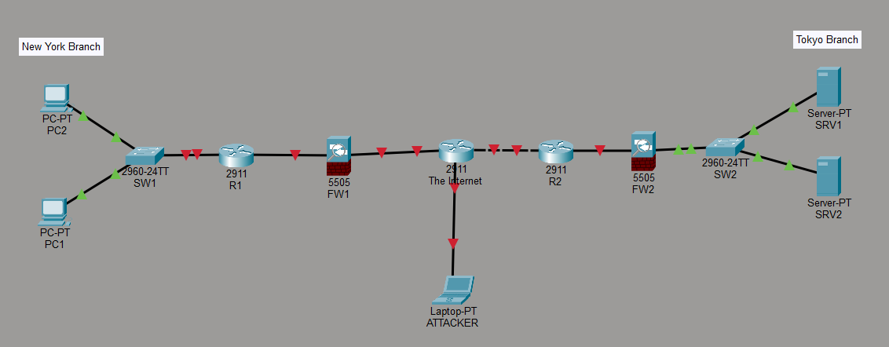

# Lab 1: Introduction to Cisco Packet Tracer: Building a Basic Multi-Site Topology

## 🎯 Objective
The primary goal of this lab is to familiarize students with the Cisco Packet Tracer user interface and demonstrate how to build a basic network topology. This lab focuses on hands-on experience in placing, naming, and connecting various network devices.

## 🗺 Network Topology
The topology represents a multi-site network consisting of:
*   **The Internet:** A central Cisco 2911 router acting as the backbone.
*   **New York Branch:** Includes two PCs, a Cisco 2960 switch (SW1), a Cisco 2911 router (R1), and a Cisco 5505 firewall (FW1).
*   **Tokyo Branch:** Includes two servers (SRV1, SRV2), a Cisco 2960 switch (SW2), a Cisco 2911 router (R2), and a Cisco 5505 firewall (FW2).
*   **Attacker:** A laptop connected directly to "The Internet" router to simulate external access.

## 🛠 Steps Taken
1.  **Device Selection:** Identified and placed specific Cisco models (Routers 2911, Switches 2960, Firewalls 5505).
2.  **Labeling:** Renamed all devices according to the architecture for better management.
3.  **Connectivity:** Established physical connections using appropriate cabling (Copper Straight-Through/Cross-over).
4.  **UI Customization:** Adjusted preferences for better visibility of port labels and device names.

## 📸 Topology Preview

## 🔗 Resources
*   **Lab File:** [Download .pkt file](./lab_file.pkt)
*   **Video Reference:** [CCNA Course - Lab 1](https://www.youtube.com/watch?v=a1Im6GYaSno&list=PLxbwE86jKRgMpuZuLBivzlM8s2Dk5lXBQ&index=3 )
