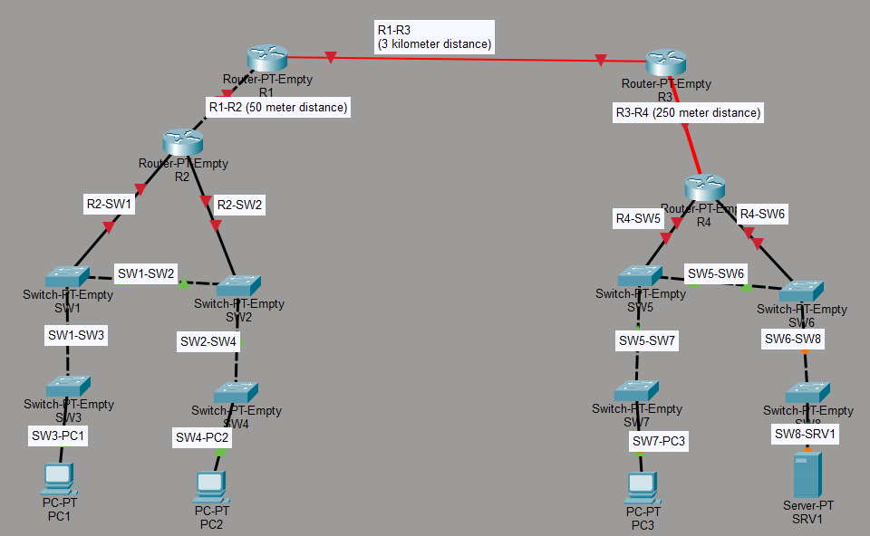

# Lab 02 — Cabling and distances

[← All labs](../README.md) · [Download lab](./lab_file.pkt)

## 🎯 Objective
The primary goal of this lab is to practically apply knowledge of network cabling by connecting various network devices—including PCs, switches, and routers—using the appropriate types of cables. This lab emphasizes understanding device pinouts and roles, as Auto MDI-X is assumed to be disabled, requiring manual cable selection.

## 🗺 Network Topology
The lab features a complex multi-segment network topology demonstrating various cabling scenarios:
*   **Routers:** R1, R2, R3, R4 (Router-PT-Empty models).
*   **Switches:** SW1, SW2, SW3, SW4, SW5, SW6, SW7, SW8 (Switch-PT-Empty models).
*   **End Devices:** PC1, PC2, PC3, SRV1.

## 🔌 Types of Cables Used & Distances
| Cable Type | Usage Scenario | Distance Considerations | Examples in Lab |
| :--------- | :------------- | :---------------------- | :-------------- |
| **Copper Straight-Through** | Connecting dissimilar devices | Up to 100 meters | PC1-SW3, R2-SW1, SRV1-SW8 |
| **Copper Crossover** | Connecting similar devices | Up to 100 meters | SW1-SW2, R1-R2 (50m) |
| **Single-mode Fiber** | Long-distance connections | Depends on optics, fiber, and link budget | R1-R3 (3 km) |
| **Multi-mode Fiber** | Intermediate-distance connections | Depends on optics, fiber grade, and speed | R3-R4 (250m) |

Fiber reach is not a fixed property of “single-mode” or “multi-mode” alone. The 3 km and 250 m values below describe this lab's scenarios, rather than universal cable limits.

## 🛠 Steps Taken
1.  **End Device to Switch Connections:** Utilized copper straight-through cables.
2.  **Switch Interconnections:** Employed copper crossover cables.
3.  **Switch to Router Connections:** Used copper straight-through cables.
4.  **Router Interconnections:**
    *   **R2 to R1:** Copper crossover cable (50m).
    *   **R1 to R3:** Single-mode fiber optic cable (3 km).
    *   **R3 to R4:** Multi-mode fiber optic cable (250m).

## 📸 Topology Preview

## 🔗 Resources
*   **Lab File:** [Download .pkt file](./lab_file.pkt)

## Review checklist

- [ ] Explain the manual cable choice for each copper link under the lab's Auto MDI-X assumption.
- [ ] Check that the selected ports support the intended medium.
- [ ] Treat the listed fiber distances as lab scenarios; consult the specifications of the actual optics and fiber when designing a real link.

These are suggested checks for the learner, not recorded test results.
