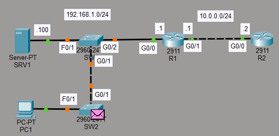

# Lab 3: OSI Model Traffic Analysis and Protocol Encapsulation

## 🎯 Objective
The primary goal of this lab is to visualize and understand the **OSI Model** layers by analyzing real-time and simulated network traffic within Cisco Packet Tracer. Specifically, it focuses on using **Simulation Mode** to inspect various network protocols (STP, OSPF, and DHCP) and identify their operational layers.

## 💻 Commands Used (on PC1)
*   `ipconfig`: View current IP configuration.
*   `ipconfig /release`: Release current DHCP IP.
*   `ipconfig /renew`: Request new IP (Generates Layer 7 DHCP traffic).

## 🛠 Steps Taken
1.  **Enter Simulation Mode:** Captured and inspected individual packets.
2.  **Analyze STP & OSPF:** Observed background traffic; STP (Layer 2) and OSPF (Layer 3).
3.  **Generate DHCP Traffic:** Executed `ipconfig /renew` to trigger a DHCP request.
4.  **Inspect PDU Details:** Analyzed DHCP packets reaching **Layer 7 (Application Layer)**, using UDP (L4), IP (L3), and Ethernet (L2).
5.  **Review Layer Encapsulation:** Observed "In Layers" and "Out Layers" to understand device processing.

## 📸 Topology Preview

## 🔗 Resources
*   **Lab File:** [Download .pkt file](./lab_file.pkt)
