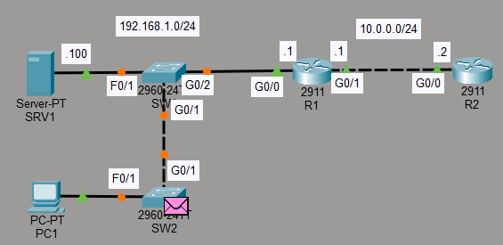

# Lab 03 — OSI model traffic analysis

[← All labs](../README.md) · [Download lab](./lab_file.pkt)

## 🎯 Objective
The primary goal of this lab is to visualize and understand the **OSI Model** layers by analyzing simulated network traffic within Cisco Packet Tracer. Specifically, it focuses on using **Simulation Mode** to inspect various network protocols (STP, OSPF, and DHCP) and identify their operational layers.

## 💻 Commands Used (on PC1)
*   `ipconfig`: View current IP configuration.
*   `ipconfig /release`: Release current DHCP IP.
*   `ipconfig /renew`: Request or renew a DHCP lease; the assigned address may remain the same.

## 🛠 Steps Taken
1.  **Enter Simulation Mode:** Captured and inspected individual packets.
2.  **Analyze STP & OSPF:** Observed background traffic; STP (Layer 2) and OSPF (Layer 3).
3.  **Generate DHCP Traffic:** Executed `ipconfig /renew` to trigger a DHCP request.
4.  **Inspect PDU Details:** Analyzed DHCP packets reaching **Layer 7 (Application Layer)**, using UDP (L4), IP (L3), and Ethernet (L2).
5.  **Review Layer Encapsulation:** Observed "In Layers" and "Out Layers" to understand device processing.

## 📸 Topology Preview

## 🔗 Resources
*   **Lab File:** [Download .pkt file](./lab_file.pkt)

## Review checklist

- [ ] Inspect an STP event and identify its Layer 2 role.
- [ ] Inspect an OSPF event and identify its Layer 3 role.
- [ ] Inspect DHCP traffic and distinguish the application message from its UDP, IP, and Ethernet encapsulation.
- [ ] Compare the PC's address information before release and after renewal; record what you actually observe.

These are suggested checks for the learner, not recorded test results.
